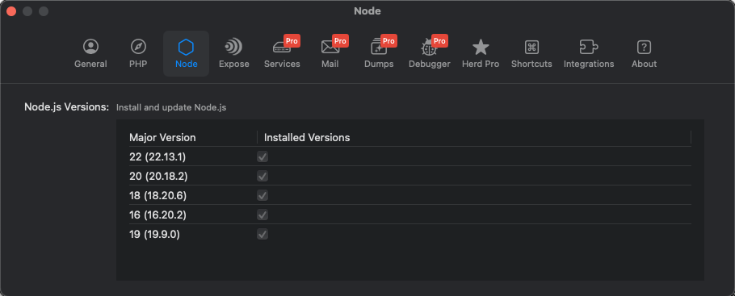
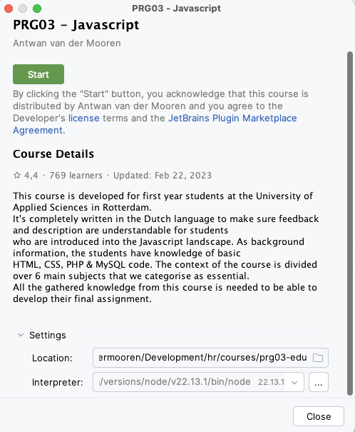
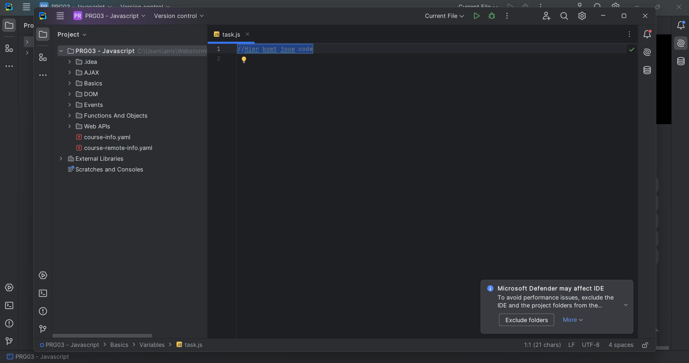
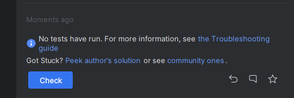

# EDU-course

Tijdens deze cursus bereid je jezelf per les voor door middel van de
EDU-course. Dit is een middel om alle Javascript theorie uit dit kwartaal
tot je te nemen en gemakkelijk te kunnen herhalen als je iets nog niet
helemaal snapt.

> ⚠️ **Let op**: Meedoen aan deze EDU-course is verplicht. Deze opdrachten zijn
> voorwaardelijk om mee te mogen doen aan de praktijkopdracht. Lees de eisen
> hiervoor goed na in hoofdstuk 3.2 van de cursushandleiding.

## Inhoudsopgave

- [Installatie](#installatie)
    - [NodeJS](#nodejs)
    - [JetBrains Academy Plugin](#jetbrains-academy-plugin)
- [Starten met course](#starten-met-course)
    - [Werken met de browser](#werken-met-de-browser)
- [Troubleshooting](#troubleshooting)
    - [Node/NPM bestaat niet](#nodenpm-bestaat-niet)
    - [Project opent raar zonder normaal scherm](#project-opent-raar-zonder-normaal-scherm)
    - [Test kunnen niet gecheckt worden](#test-kunnen-niet-gecheckt-worden)

## Installatie

### NodeJS

NodeJS is mee geïnstalleerd via Herd. Controleer dit en installeer waar nodig
de laatste versie in je Herd zodat je kunt werken met Node.

> Als je geen Herd gebruikt (lees: je herkanst) heb je Node al op je laptop staan,
> of kun je deze opnieuw installeren via de NodeJS website.

|  | 
|:----------------------------------------:| 
|           *Herd Node settings*           |

### JetBrains Academy Plugin

Om de EDU-course te kunnen starten heb je de "JetBrains Academy" plugin nodig.
Deze kun je installeren door in PhpStorm naar je `Settings -> Plugins` te
gaan en daar te zoeken op "JetBrains Academy" in de Marketplace. Na installatie
moet je PhpStorm opnieuw opstarten.

> ⚠️ Er wordt na installatie gevraagd akkoord te gaan met de voorwaarden. Keur dit
> goed aangezien de plugin anders niet zal werken!

|  | 
|:------------------------------------------------------------:| 
|                  *JetBrains Academy plugin*                  |

Na herstart kun je via `File -> Learn & Teach -> Browse courses` zorgen dat je
de course kunt gaan zoeken. Binnen dat venster kies je rechtsbovenin voor de
"Dutch language" zodat de course tevoorschijn komt.

|  | 
|:-----------------------------------------------------:| 
|            *De Nederlandse taal aanzetten*            |

Kies daarna `PRG03 - Javascript` en pas onder `Settings` het pad aan waar het project
wordt neergezet. Dit moet namelijk binnen je Herd map gedaan worden zodat je dit project
ook in je browser kunt openen/testen. Geef het bijvoorbeeld de naam `prg03-edu` zodat
je het project later goed kunt terugvinden.

|  | 
|:-------------------------------------:| 
|  *Let op je pad binnen de settings!*  |

Druk nu op `Start`. Daarmee wordt het nieuwe project geopend en volgt een scherm
waarin je een hoop commando's voorbij ziet komen omdat de course voor je
geïnstalleerd wordt. Wanneer je onderstaande ziet, is hij klaar en kun je dat
venster sluiten.

|  | 
|:---------------------------------------------:| 
|     *Wacht tot installatie 'finished' is*     |

## Starten met course

De installatie is gelukt en je kunt komende lessen dus voorbereid inkomen door
de gevraagde onderdelen uit te voeren.

> Bekijk op Brightspace dus goed wanneer jij jouw bewijs per onderdeel moet
> inleveren. Als je dit vergeet loop je het risico niet mee te kunnen doen
> aan de praktijkopdracht.

In de structuur zie je links de opdrachten, in het midden de code die je gaat
schrijven en rechts de uitleg wat je moet doen voor de betreffende opdracht.
Lees per opdracht de uitleg aan de rechterzijde aandachtig en gebruik evt.
de linkjes naar externe bronnen om je verder in te lezen.

|  | 
|:---------------------------------------------:| 
|           *Overzicht van de course*           |

Wanneer je een opdracht hebt uitgevoerd klik je op de knop `Check`. Jouw code
wordt dan gecontroleerd en je ontvangt direct feedback wanneer het antwoord
nog niet goed is. Gebruik deze feedback om jouw antwoord aan te vullen.
Je kunt het zo vaak proberen als je wilt. Mocht je uiteindelijk niet uit een
opdracht komen, dan kun je de "Peek Solution" knop gebruiken. Daarmee kun je jouw
eigen antwoord vergelijken met het goede antwoord.

> De "Peek Solution" optie kun je natuurlijk ook gebruiken als je het wel goed hebt
> gedaan. Misschien verschilt de uitwerking en kun je daar weer van leren om je code
> netter te maken.

|  | 
|:-------------------------------------------:| 
|      *Feedback na beantwoorden vraag*       |

|     | 
|:-------------------------------------------------:| 
| *Peek Solution kun je gebruiken als je vastloopt* |

Wanneer je de opdracht uiteindelijk, met of zonder hulp, goed hebt opgelost, dan wordt
die opdracht links in de lijst groen. Wanneer jij jouw voortgang moet inleveren voor de
vereiste deadlines, dan moet je een screenshot inleveren waarop duidelijk te zien is dat
de vereiste opdrachten groen zijn.

|  | 
|:--------------------------------------------:| 
|    *Zichtbare voortgang binnen de course*    |

### Werken met de browser

Vanaf de opdrachten in het mapje `DOM` heb je ook je browser nodig. Aangezien je het
project in je Herd map hebt gezet kun je via http://prg03-edu.test direct
bij de uitwerkingen van dit project. Je kunt alle bestanden die je niet herkent (op
onderstaande afbeelding rood omcirkelt) negeren. Dit zijn bestanden die op de achtergrond
nodig zijn om de course en bijbehorende tests te laten werken, maar deze zijn niet
zichtbaar binnen je PhpStorm.

|  | 
|:----------------------------------------------:| 
|      *Overzichtspagina course in browser*      |

Navigeer naar de map waar jij jouw opdracht wilt testen. Bijvoorbeeld `DOM -> Selecting`
en open daar je console om je output te kunnen testen. Via
[deze website](https://balsamiq.com/support/faqs/browserconsole/) kun je inzien hoe je
de console per browser kunt activeren. Alle `console.log` statements zijn hier zichtbaar
wat je kan helpen tijdens het maken van de opdrachten.

|   | 
|:--------------------------------------------------:| 
| *DOM -> Selecting opdracht met console in browser* |

> Ben niet bang om fouten te maken. Het hele doel van deze opdrachten is dat je
> voorbereid bent op de les, maar ook dat je in je eigen tijd nog kunt oefenen als
> je bepaalde concepten nog moeilijk vindt. Vooral veel plezier gewenst! 🎉

## Troubleshooting

Mocht je tegen issues aanlopen tijdens de installatie staan hieronder de meest
voorkomende problemen met bijbehorende oplossingen.

### Node/NPM bestaat niet

Mocht Node/NPM niet goed geïnstalleerd zijn op je machine kun je het installeren
vanuit de NodeJS website. Kies hiervoor de installer (dus geen ZIP): https://nodejs.org/en/download

### Project opent raar zonder normaal scherm

Als je onderstaand scherm ziet, betekent dit dat je de voorwaarden van de plugin
niet hebt goedgekeurd toen hierom werd gevraagd.

|  | 
|:-------------------------------------------------:| 
|       *Cursus opent als project IPV cursus*       |

Ga naar je settings en zet het vinkje alsnog aan zodat je de plugin kunt gebruiken.

|  | 
|:---------------------------------------------------:| 
|          *Keur de voorwaarden alsnog goed*          |

### Test kunnen niet gecheckt worden

Als je onderstaande ziet, kun je wel code schrijven, maar geen checks uitvoeren. Daarmee
kun je de opdrachten dus niet uitvoeren.

|  | 
|:----------------------------------------:| 
|   *Tests kunnen niet gecheckt worden*    |

Om dit op te lossen open je de terminal in je phpStorm van het cursusproject, en voer
je het volgende commando uit:

```bash
npm install jest@23.6.0
```

Happy coding! 🎉
